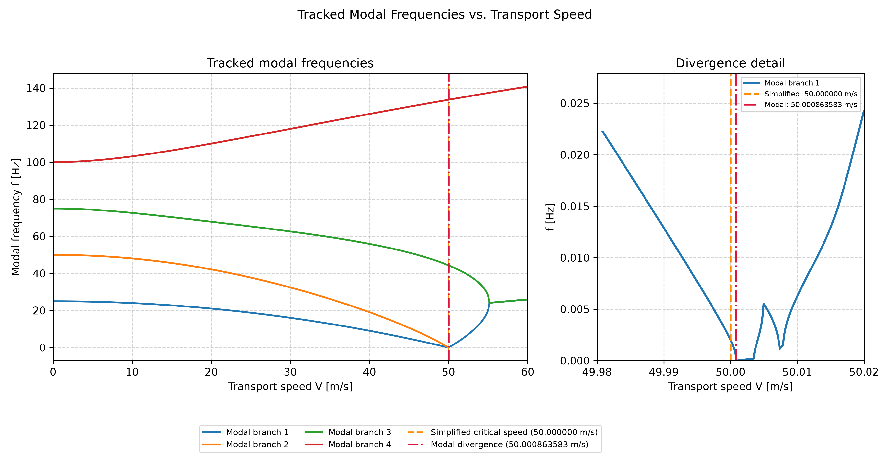
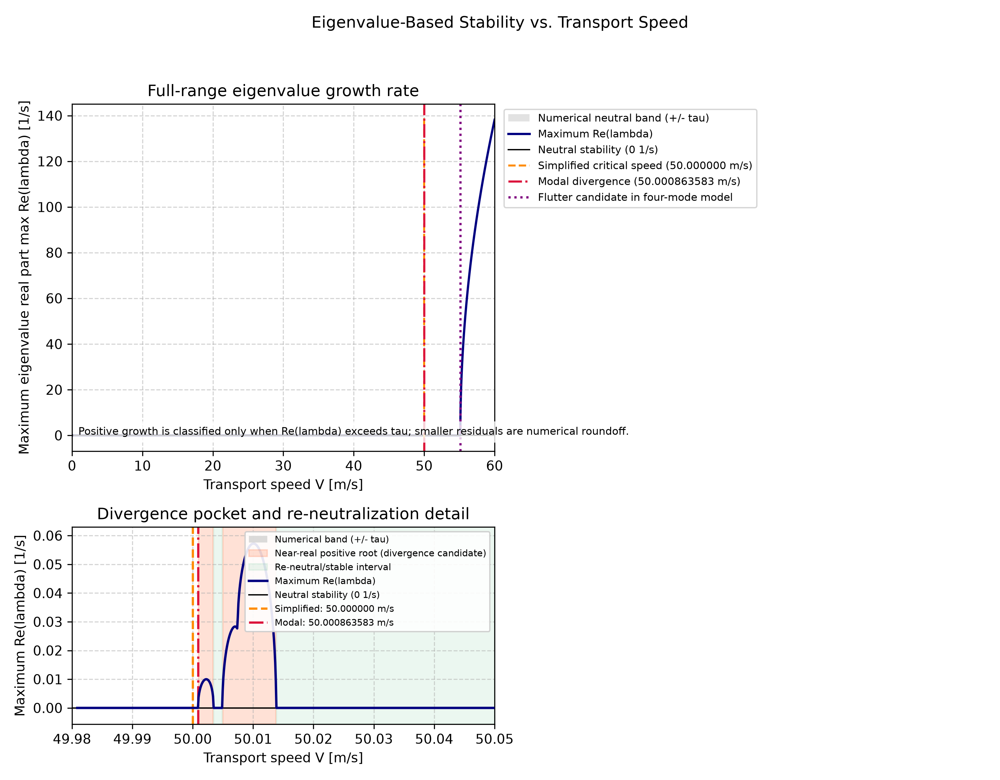

# Eksenel Hareketli Esnek Şeritlerin Titreşim ve Kararlılık Analizi

Bu proje, iki merdane arasında sabit hızla taşınan, başlangıç gerginliği altındaki esnek bir şeridin enine titreşim cevabını ve basitleştirilmiş statik kritik hızını inceler. Sürekli model Euler-Bernoulli kiriş yaklaşımıyla ifade edilir; Galerkin yöntemiyle sonlu sayıda modal koordinata indirgenir ve zaman cevabı doğrusal durum-uzayı modelinden hesaplanır.

## Model Varsayımları

- Doğrusal Euler-Bernoulli kiriş modeli kullanılır.
- Enine yer değiştirmeler küçüktür ve doğrusal davranış varsayılır.
- Eksenel taşıma hızı sabittir.
- Başlangıç gerginliği sabittir.
- Uçlarda basit mesnetli sınır koşulları uygulanır.
- Galerkin yaklaşımında dört sinüs modu kullanılır.
- Fiziksel veya viskoz sönüm bulunmaz; hız matrisi yalnızca Coriolis/gyroskopik katkıyı temsil eder.
- Dış kuvvet bulunmaz; zaman cevabı serbest titreşimdir.
- Şerit dikdörtgen ve düzgün kesitlidir; malzeme izotropik kabul edilir.

## Hareket Denklemi

Kullanılan doğrusal enine hareket denklemi:

$$
\rho A\left(w_{tt}+2Vw_{xt}+V^2w_{xx}\right)
+EIw_{xxxx}-T_0w_{xx}=0.
$$

| Sembol | Açıklama | SI birimi |
|---|---|---|
| $x$ | Şerit boyunca konum | m |
| $t$ | Zaman | s |
| $w(x,t)$ | Enine yer değiştirme | m |
| $V$ | Eksenel taşıma hızı | m/s |
| $\rho A$ | Doğrudan verilen çizgisel kütle yoğunluğu | kg/m |
| $E$ | Young modülü | Pa (N/m²) |
| $I$ | Kesitin ikinci alan momenti | m⁴ |
| $EI$ | Eğilme rijitliği | N·m² |
| $T_0$ | Başlangıç gerginliği | N |
| $L$ | Serbest açıklık | m |
| $A$ | Kesit alanı | m² |
| $b$, $h$ | Dikdörtgen kesit genişliği ve kalınlığı | m |
| $w_{tt}, w_{xt}, w_{xx}, w_{xxxx}$ | İlgili zamansal ve uzaysal kısmi türevler | Türev mertebesine göre |

Burada $\rho A$ çizgisel kütle yoğunluğudur; ayrıca bir malzeme yoğunluğu tanımlanmamıştır.

### Sınır Koşulları

Basit mesnetli uçlar için:

$$
w(0,t)=w(L,t)=0,
\qquad
w_{xx}(0,t)=w_{xx}(L,t)=0.
$$

## Galerkin Modeli

Enine yer değiştirme, $N=4$ sinüs modu ile yaklaşık temsil edilir:

$$
w(x,t)=\sum_{n=1}^{N}\phi_n(x)q_n(t),
\qquad
\phi_n(x)=\sin\left(\frac{n\pi x}{L}\right).
$$

Galerkin izdüşümü aşağıdaki modal sistemi verir:

$$
M\ddot{q}+C\dot{q}+K_{\mathrm{eff}}q=0.
$$

- $M$: modal kütle matrisi.
- $C$: eksenel hareketten kaynaklanan anti-simetrik Coriolis/gyroskopik matris. Bu matris fiziksel veya viskoz sönüm değildir.
- $K_{\mathrm{eff}}$: eğilme rijitliği, başlangıç gerginliği ve $\rho A V^2$ hız teriminin oluşturduğu merkezkaç yumuşamasını içeren efektif rijitlik matrisi.

## Fiziksel Parametreler

| Parametre | Değer | Birim / açıklama |
|---|---:|---|
| $L$ | 1.0 | m |
| $b$ | 0.5 | m |
| $h$ | 0.0002 | m |
| $\rho A$ | 0.08 | kg/m; çizgisel kütle yoğunluğu |
| $E$ | $2.1\times10^9$ | Pa |
| $T_0$ | 200 | N |
| $A=bh$ | 0.0001 | m² |
| $I=bh^3/12$ | $3.333333333\times10^{-13}$ | m⁴ |
| $EI$ | 0.0007 | N·m² |
| $N$ | 4 | mod sayısı |

## Basitleştirilmiş Kritik Hız

Gergi baskın basitleştirilmiş kritik hız bağıntısı:

$$
V_{\mathrm{cr}}=\sqrt{\frac{T_0}{\rho A}}.
$$

Nominal parametrelerle $V_{\mathrm{cr}}=50\ \mathrm{m/s}$ elde edilir. Bu değer basitleştirilmiş statik kritik hız sınırıdır. Sonlu eğilme rijitliği ve modal model hesaba katıldığında daha ayrıntılı kritik hız değerlendirmeleri yapılabilir; bu projedeki bağıntı tam modal kararlılık sınırının yerine geçmez.

[Kritik hız grafiği](results/critical_speed.png)

Grafikte kritik hızın gerginliğin kareköküyle arttığı görülür. $T_0=200\ \mathrm{N}$ için nominal nokta $V_{\mathrm{cr}}=50\ \mathrm{m/s}$ değerindedir. Gerginlik yükseldikçe bu basitleştirilmiş statik kararlılık sınırı yükselir.

## Zaman Alanı Simülasyonu

Serbest titreşim simülasyonunda başlangıç koşulları:

$$
w(x,0)=0.001\sin\left(\frac{\pi x}{L}\right),
\qquad
w_t(x,0)=0.
$$

Sinüs tabanı nedeniyle başlangıç şekli doğrudan birinci modal şekildir; dolayısıyla $q_1(0)=0.001\ \mathrm{m}$, diğer modal koordinatlar ve tüm modal hızlar sıfırdır. Çözümler 0–2 s aralığında, 4001 çıktı noktasında `scipy.integrate.solve_ivp` ve `RK45` yöntemiyle hesaplanır. Toleranslar `rtol=1e-8` ve `atol=1e-10` değerleridir. Grafik orta nokta deplasmanını milimetre cinsinden gösterir.

[V = 10 m/s ve V = 45 m/s zaman cevabı grafiği](results/time_response.png)

$V=10\ \mathrm{m/s}$ düşük hızlı alt-kritik durumu, $V=45\ \mathrm{m/s}$ ise basitleştirilmiş kritik hıza yakın yüksek hızlı alt-kritik durumu temsil eder. $V=45\ \mathrm{m/s}$ durumunda efektif gerginlik/rijitlik katkısı azalır ve modelin etkili titreşim frekansı $V=10\ \mathrm{m/s}$ durumuna göre düşer. Her iki hesaplanan cevap da incelenen 2 saniyelik aralıkta sınırlı kalır. Modelde fiziksel sönüm olmadığı için titreşim genliği fiziksel sönüm etkisiyle azalmaz. Sonlu bir zaman aralığında sınırlı cevap elde edilmesi tek başına sistemin genel kararlılığını kanıtlamaz.

## Özdeğer Tabanlı Kararlılık Analizi

Modal sistem, $y=[q^T,\dot{q}^T]^T$ durum vektörüyle birinci mertebe durum-uzayı biçiminde yazılır:

$$
M\ddot{q}+C\dot{q}+K_{\mathrm{eff}}q=0,
\qquad
y=\begin{bmatrix}q\\\dot{q}\end{bmatrix},
\qquad
\dot{y}=A_{\mathrm{state}}y.
$$

Durum matrisi:

$$
A_{\mathrm{state}}=
\begin{bmatrix}
0 & I\\
-M^{-1}K_{\mathrm{eff}} & -M^{-1}C
\end{bmatrix}.
$$

Uygulamada açık matris tersi alınmaz; alt bloklar `np.linalg.solve` ile hesaplanır. Her hızda sekiz özdeğerin tamamı incelenir. Kararlılık, en büyük özdeğer reel kısmı ve ilgili özdeğerin sanal kısmı birlikte değerlendirilerek sınıflandırılır:

- $\operatorname{Re}(\lambda)\approx0$: sayısal tolerans içinde nötr davranış.
- $\operatorname{Re}(\lambda)>0$: büyüyen, kararsız hareket adayı.
- Pozitif reel kısım ve yaklaşık sıfır sanal kısım: divergence adayı.
- Pozitif reel kısım ve spektral ölçeğe göre belirgin, sıfırdan farklı sanal kısım: flutter adayı.

Ana hız taraması 0–60 m/s aralığında 1201 eşit nokta kullanır. Dar kritik geçişleri çözünür incelemek için diverjans çevresinde ve yaklaşık 55 m/s bölgesinde daha sık yerel hız noktaları da değerlendirilir.

Gergi baskın basitleştirilmiş referans kritik hız $V_{\mathrm{cr}}=50.000000000\ \mathrm{m/s}$ değerindedir. Sonlu eğilme rijitliğini içeren birinci modal analitik diverjans hızı ve $\lambda_{\min}(K_{\mathrm{eff}})=0$ denkleminin `brentq` ile sayısal çözümü:

$$
V_{\mathrm{div},1}=50.000863582927\ \mathrm{m/s}.
$$

Analitik ve sayısal değerler yaklaşık $7.105\times10^{-15}\ \mathrm{m/s}$ mutlak farkla eşleşir. Eğilme rijitliği modal rijitliğe pozitif katkı yaptığı için modal kritik hız, basitleştirilmiş değerden çok küçük miktarda yüksektir.

### Frekans-Hız Grafiği



İlk modal frekans divergence sınırına yaklaşırken sıfıra iner. Yüksek modların frekans dalları taşıma hızıyla farklı biçimlerde değişir. Dallar her hızda frekansa göre yeniden sıralanmak yerine, özdeğer yakınlığı ve fazdan bağımsız özvektör benzerliğiyle takip edilir. Gerçek eksene geçen özdeğerler salınım frekansı olarak çizilmez.

### Özdeğer Kararlılık Grafiği



Dört modlu modelde modal diverjans sınırının hemen üzerinde dar, yakın-reel kararsızlık cepleri ve bunların arasında/sonrasında nötr davranış örnekleri görülür. Bu ceplerin ve yeniden nötrleşme bölgelerinin fiziksel kesinliği gösterilmiş değildir; dört mod için yakınsama analizi yapılmamıştır. Bu nedenle gözlenen davranış kesin bir yeniden kararlılık kanıtı olarak yorumlanmamalı ve daha yüksek mod sayılarıyla doğrulanmalıdır.

Yerel taramada ilk flutter adayı yaklaşık $V_{\mathrm{flutter,candidate}}=55.1365\ \mathrm{m/s}$ hızında görülmüştür. Örnek özdeğer:

$$
\lambda\approx0.853821+151.606567i\ \mathrm{s^{-1}}.
$$

Bu örneğin reel kısmı pozitif, sanal kısmı sıfırdan belirgin biçimde farklıdır; bu nedenle dört modlu modelde flutter adayı olarak sınıflandırılmıştır. **Bu değer, dört modlu doğrusal modelde elde edilen bir flutter adayıdır. Kesin fiziksel flutter sınırı olarak yorumlanmadan önce mod yakınsaması ve model doğrulaması yapılmalıdır.**

Kararlılık sınıflandırmasında kullanılan ölçeğe bağlı tolerans:

$$
	au=\max\left(10^{-10},\ 100\epsilon_{\mathrm{mach}}\max\left(1,\max_j|\lambda_j|\right)\right)\ \mathrm{s^{-1}}.
$$

Bu toleransın altındaki küçük pozitif reel artıklar fiziksel büyüme yerine sayısal yuvarlama olarak değerlendirilir.

## Proje Yapısı

```text
.
├── .gitignore
├── README.md
├── requirements.txt
├── results/
│   ├── critical_speed.png
│   ├── eigenvalue_stability.png
│   ├── frequency_vs_speed.png
│   └── time_response.png
└── src/
    ├── critical_speed.py
    ├── galerkin_model.py
    ├── parameters.py
    ├── simulation.py
    └── stability_analysis.py
```

- `src/parameters.py`: Fiziksel parametreleri ve kesitten türetilen değerleri tanımlar.
- `src/critical_speed.py`: Basitleştirilmiş kritik hızı hesaplar ve gerginlik-kritik hız grafiğini üretir.
- `src/galerkin_model.py`: Sinüs modlarıyla Galerkin kütle, Coriolis/gyroskopik ve efektif rijitlik matrislerini oluşturur ve matris kontrollerini yapar.
- `src/simulation.py`: Durum-uzayı modelini kurar, iki taşıma hızındaki serbest titreşim cevaplarını çözer ve zaman cevabı grafiğini kaydeder.
- `src/stability_analysis.py`: Hız taramasında durum matrisi özdeğerlerini, izlenen frekans dallarını ve dört modlu modelin kararlılık adaylarını inceler; frekans-hız ve özdeğer kararlılık grafiklerini üretir.
- `results/`: Üretilen ve repozitörde tutulan grafik çıktıları.

## Kurulum

Windows PowerShell'de proje kök dizininden:

```powershell
python -m venv .venv
Set-ExecutionPolicy -Scope Process -ExecutionPolicy Bypass
.\.venv\Scripts\Activate.ps1
python -m pip install -r requirements.txt
```

## Çalıştırma

Proje kök dizininde aşağıdaki komutları sırayla çalıştırın:

```powershell
.\.venv\Scripts\python.exe src\critical_speed.py
.\.venv\Scripts\python.exe src\galerkin_model.py
.\.venv\Scripts\python.exe src\simulation.py
.\.venv\Scripts\python.exe src\stability_analysis.py
```

## Doğrulanan Sonuçlar

- Kesit alanı: $A=0.0001\ \mathrm{m^2}$.
- İkinci alan momenti: $I=3.333333333\times10^{-13}\ \mathrm{m^4}$.
- Eğilme rijitliği: $EI=0.0007\ \mathrm{N\,m^2}$.
- Nominal basitleştirilmiş kritik hız: $V_{\mathrm{cr}}=50\ \mathrm{m/s}$.
- $V=10\ \mathrm{m/s}$ ve $V=45\ \mathrm{m/s}$ zaman cevabı çözümleri başarıyla tamamlanmıştır.
- Her iki çözümün başlangıç orta nokta deplasmanı 1 mm'dir.

## Model Sınırlamaları

- Model doğrusal ve küçük enine deplasman varsayımına dayanır.
- Fiziksel/viskoz sönüm ve dış kuvvet yoktur.
- Merdane temas mekaniği modellenmez.
- Gerginlik sabit kabul edilir.
- Malzeme izotropik kabul edilir.
- Özdeğer analizi dört Galerkin moduyla sınırlıdır; mod sayısı yakınsama analizi yapılmamıştır.
- Dar yeniden kararlılık bölgeleri daha yüksek mod sayılarıyla doğrulanmalıdır; mevcut sonuçlar kesin yeniden kararlılık kanıtı değildir.
- Flutter sonucu bir aday değer olarak değerlendirilmelidir; kesin sınır değildir.
- Doğrusal model merdane temasını ve fiziksel sönümü içermez.
- Basitleştirilmiş kritik hız formülü, sonlu eğilme rijitliğini içeren tam modal kritik hız analizi değildir.

## Kaynakça

Bu çalışma, literatürden esinlenilmiş parametrelerle hazırlanmıştır. Belirli bir yayını kaynak göstermek için gerekli tam bibliyografik bilgiler mevcut olmadığından doğrulanmamış bir bibliyografik kayıt eklenmemiştir.
